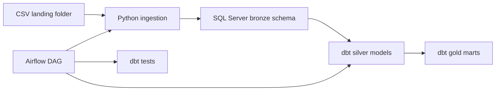

# On-Prem SQL Server Medallion Pipeline

This is a starter end-to-end data warehouse pipeline for CSV source files using:

- SQL Server as the warehouse
- Python for CSV ingestion into Bronze
- dbt for Silver and Gold transformations
- Airflow for orchestration

## Architecture



## Data Layers

| Layer | Purpose | Owner |
| --- | --- | --- |
| Landing | Original CSV files dropped by source systems | Source/application teams |
| Bronze | Raw, append-only SQL Server tables with file/batch metadata | Python ingestion |
| Silver | Cleaned, typed, deduplicated business entities | dbt |
| Gold | Analytics-ready facts, dimensions, and marts | dbt |

## Repository Layout

```text
.
├── airflow/
│   └── dags/
│       └── medallion_csv_pipeline.py
├── config/
│   └── sources.yml
├── dbt/
│   ├── dbt_project.yml
│   ├── models/
│   │   ├── silver/
│   │   └── gold/
│   └── profiles.yml.example
├── landing/
│   ├── incoming/
│   ├── archive/
│   └── rejected/
├── scripts/
│   └── ingest_csv_to_bronze.py
├── .env.example
└── requirements.txt
```

## Flow

1. CSV files arrive in `landing/incoming/<source_name>/`.
2. Airflow runs `scripts/ingest_csv_to_bronze.py`.
3. The Python loader:
   - reads configured CSV files in chunks
   - loads every source column as text into SQL Server Bronze
   - adds `_batch_id`, `_source_file`, `_loaded_at_utc`, and `_source_row_number`
   - records status in `bronze.ingestion_file_log`
   - moves successful files to `landing/archive/<source_name>/`
   - moves failed files to `landing/rejected/<source_name>/`
4. Airflow runs `dbt run --select silver+`.
5. Airflow runs `dbt test`.

## Setup

Create a Python virtual environment and install dependencies:

```powershell
python -m venv .venv
.\.venv\Scripts\Activate.ps1
pip install -r requirements.txt
```

Copy `.env.example` to `.env` and set your SQL Server values.

Install an ODBC driver on the Airflow/Python host. For Microsoft SQL Server, use ODBC Driver 18 or 17.

## Configure Sources

Edit `config/sources.yml`.

Each source maps CSV files to one Bronze table. The default pattern loads files from:

```text
landing/incoming/<source_name>/*.csv
```

Example:

```yaml
sources:
  - name: customers
    bronze_table: raw_customers
    file_pattern: "*.csv"
    delimiter: ","
    encoding: "utf-8"
    has_header: true
```

## Run Ingestion Locally

```powershell
python scripts/ingest_csv_to_bronze.py --config config/sources.yml
```

## Run dbt Locally

```powershell
cd dbt
dbt debug --profiles-dir .
dbt run --profiles-dir .
dbt test --profiles-dir .
```

## Production Notes

- Keep Bronze append-only where possible.
- Treat source files as immutable evidence; archive them after load.
- Use SQL Server Agent, storage ACLs, or Airflow sensors to control file arrival.
- Add source-specific Silver models for typing, validation, deduplication, and business rules.
- Promote only curated dbt models into Gold.
- Add file-level reconciliation checks: row counts, mandatory columns, duplicate keys, and load timestamps.
